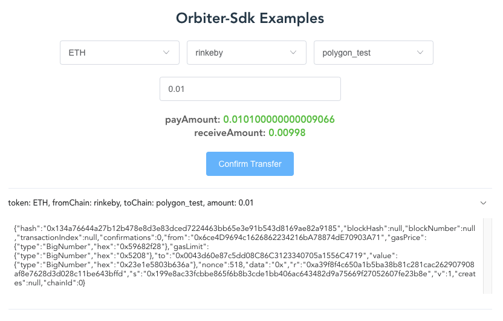

# Orbiter-Sdk

[](https://github.com/prettier/prettier)
[](https://greenkeeper.io/)
[](https://github.com/linkdrone/orbiter-sdk)

Orbiter-Sdk is a secure and fast Layer2 cross-platform transfer library

## Usage

```bash
# Use yarn
yarn add orbiter-sdk

# Or use npm
npm install orbiter-sdk --save
```

## Examples

### Frontend



Front-end example project based on vue3+vite. [dir](./example/frontend/)

## Types

### BridgeToken

| Field        |  type  | default |               desc               |
| :----------- | :----: | :-----: | :------------------------------: |
| chainId      | number |    -    |        Orbiter's chainId         |
| name         | string |    -    |    Token name. ex: ETH, USDC     |
| address      | string |    -    |      Token contract address      |
| precision    | number |    -    |          Token decimals          |
| makerAddress | string |    -    | Orbiter's maker ethereum address |
| icon         | string |    -    |         Token icon(TODO)         |

### BridgeChain

| Field     |       type       | default |       desc        |
| :-------- | :--------------: | :-----: | :---------------: |
| id        |      number      |    -    | Orbiter's chainId |
| name      |      string      |    -    |    Chain name     |
| networkId | number \| string |    -    |  Chain nerworkId  |
| icon      |      string      |    -    | Chain icon(TODO)  |

### BridgeNetwork

value: `'Mainnet' | 'Testnet'`

## Classes

### Bridge

```TypeScript
// constructor
const bridge = new Bridge('Mainnet' or 'Testnet')
```

#### bridge.getNetwork

Params: -

Return: `'Mainnet' | 'Testnet'`

#### bridge.supports

> Usage example: around line 118 in [the file](./example/frontend/src/components/HomeView.vue)

Params:
| Field | type | default | desc |
| :-------- | :---------: | :-------: | :-----------------: |
| fromChain | BridgeChain | undefined | Selected from chain |
| toChain | BridgeChain | undefined | Selected to chain |

Return:
| Field | type | default | desc |
| :-------- | :---------: | :-------: | :-----------------: |
| tokens | BridgeToken[] | - | Support tokens |
| fromChains | BridgeChain[] | - | Support fromChains |
| toChains | BridgeChain[] | - | Support toChains |

#### bridge.getAmounts

> Usage example: around line 151 in [the file](./example/frontend/src/components/HomeView.vue)

Params:
| Field | type | default | desc |
| :-------- | :---------: | :-------: | :-----------------: |
| token | BridgeToken | - | Selected token |
| fromChain | BridgeChain | - | Selected from chain |
| toChain | BridgeChain | - | Selected from chain |
| amountHm | string \| number | undefined | Human readable amount. ex: 0.01 |

Return:
| Field | type | default | desc |
| :-------- | :---------: | :-------: | :-----------------: |
| payText | string | - | Orbiter identification code |
| payAmount | ethers.BigNumber | - | Bignumbber pay amount |
| payAmountHm | string | - | Human readable pay amount |
| receiveAmountHm | string | - | Human readable receive amount |

#### bridge.transfer

> Usage example: around line 167 in [the file](./example/frontend/src/components/HomeView.vue)

Params:
| Field | type | default | desc |
| :-------- | :---------: | :-------: | :-----------------: |
| signer | ethers.Signer | - | Ethereum signer. ex: new providers.Web3Provider(window.ethereum).getSigner() |
| token | BridgeToken | - | Selected token |
| fromChain | BridgeChain | - | Selected from chain |
| toChain | BridgeChain | - | Selected from chain |
| amountHm | string \| number | undefined | Human readable amount. ex: 0.01 |

Return: The current data structure returned by different from chains, no unified data structure yet

## Features

- [x] Bridge support
- [ ] Bridge.transfer return unified data structure
- [ ] Bridge.getSave support. (Get save times an fee using orbiter)
- [ ] Bridge.transferListen support. (Listen transfer into user address)
